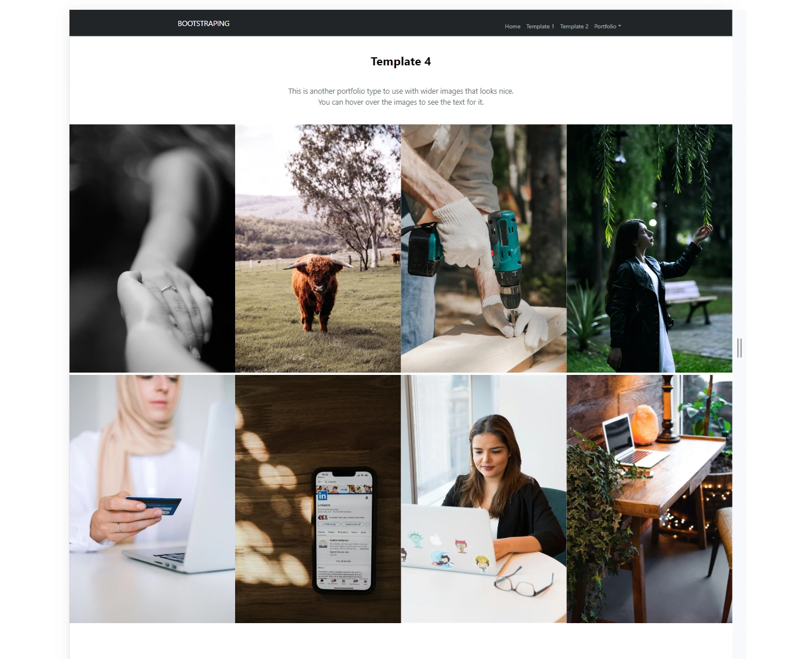
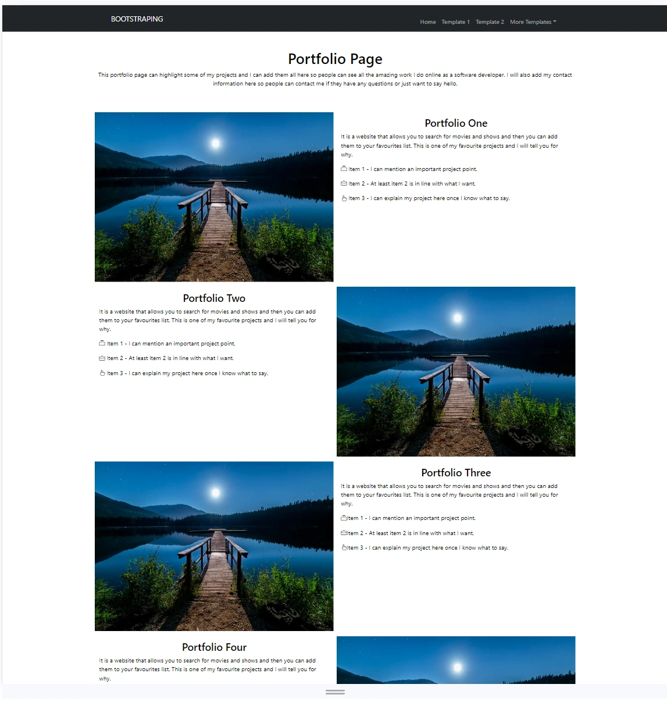
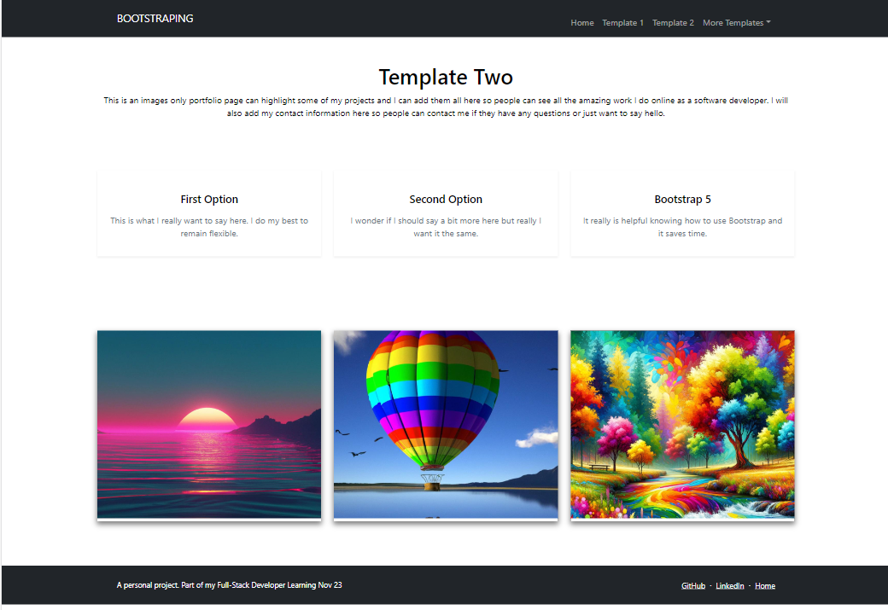
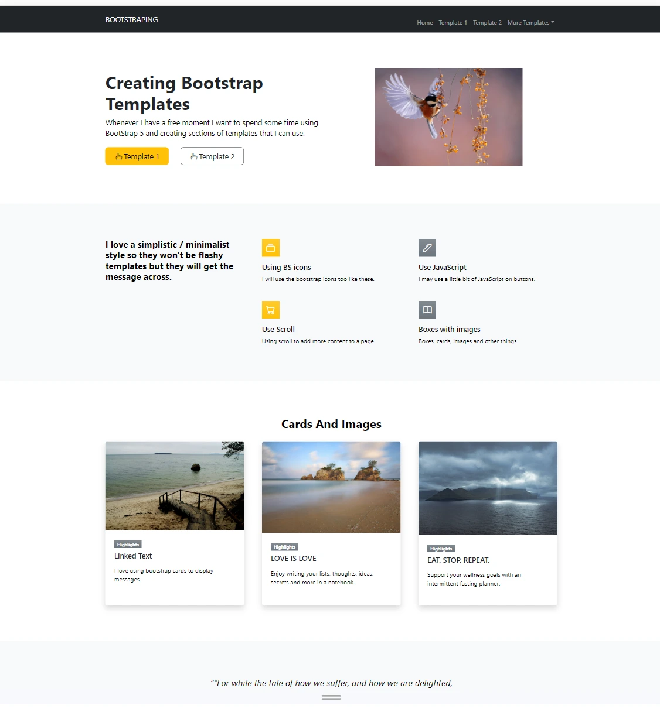

# bootstraping

A place I use to create different bootstrap templates I might use on my projects. They all use Bootstrap 5 and when I find myself with some time on my hands and/or I want to get away from backend and play with a little front-end, I go through bootstrap and see what I can make.

They are all 100% mobile-first, fully responsive sections and I can pick and choose from any of them and put them together to create different looks.

# For example

## Template 4 has large images

## Template 3 has images and text

## Template 2 shows three images

This uses a modal. When you click on an image it shows up and you can link to a project or product

## Index
The index page has a full page template and is one I used on [Pen and I Publishing](https://www.penandipublishing.com/)

## Bootstrap Examples

You can find loads of Bootstrap examples that you can play around with at

[Tutorial Republic](https://www.tutorialrepublic.com/twitter-bootstrap-examples.php)

[Tutorial Republic Snippets](https://www.tutorialrepublic.com/snippets/gallery.php?page=2 )

They also have a range of snippets 